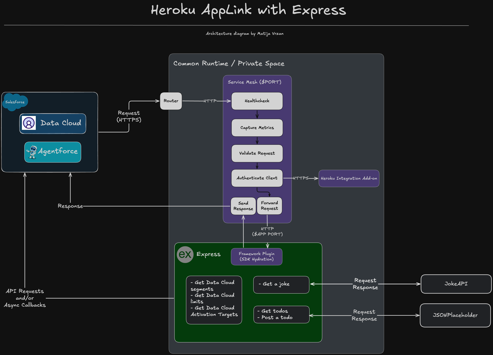

<p align="center">
<a  href="https://www.heroku.com/"></a>
<a href="https://expressjs.com/"></a>
<p/>

# Heroku AppLink Express Example

Learn how you can leverage Heroku AppLink with a Node.js Express server to exposes your Heroku app as API services in Salesforce.

# Table of Contents

- [Heroku AppLink Express Example](#heroku-applink-express-example)
- [Table of Contents](#table-of-contents)
  - [What does it do?](#what-does-it-do)
  - [How does it work?](#how-does-it-work)
  - [Project Structure](#project-structure)
  - [API Documentation](#api-documentation)
    - [Non-Salesforce Endpoints](#non-salesforce-endpoints)
    - [Salesforce Endpoints](#salesforce-endpoints)
    - [Architecture diagram](#architecture-diagram)
  - [Technologies used](#technologies-used)
- [Configuration](#configuration)
  - [Requirements](#requirements)
  - [Setup](#setup)
    - [Local environment configuration](#local-environment-configuration)
  - [Troubleshooting](#troubleshooting)
    - [Common Issues](#common-issues)
- [License](#license)
- [Disclaimer](#disclaimer)

---

## What does it do?

This project demonstrates how to build a Node.js Express application that integrates with Salesforce using Heroku AppLink. It provides a working example of an API that can interact with Salesforce Data Cloud, handle data change events, and expose endpoints for both Salesforce and non-Salesforce operations.

## How does it work?

This application leverages the Heroku App Link and Service Mesh to create a bridge between your Heroku application and Salesforce. Here's the flow:

1. **Integration Setup**

   - The application uses the Heroku Integration Service Mesh as middleware to handle authentication and context passing between Salesforce and your Express application

2. **Authentication Flow**

   - When Salesforce calls your API, it includes OAuth tokens and client context
   - The `heroku-service-mesh` middleware:
     - Intercepts incoming requests
     - Validates and extracts Salesforce authentication credentials
     - Enriches your request object with Salesforce context

3. **Data Exchange**

   - For Salesforce endpoints:

     - Your Express routes leverage the enriched request to make authenticated API calls to Salesforce
     - The middleware handles security and context parsing automatically

   - For non-Salesforce endpoints:
     - Standard Express handlers process requests without Salesforce authentication

4. **Async Processing**

   - For endpoints that require longer processing (like data change events):
     - The application implements an async pattern with immediate 201 responses
     - Processing continues in the background
     - The `asyncMiddleware` helper manages this workflow

5. **API Exposure**
   - Once deployed to Heroku, the API becomes available for connection from Salesforce
   - The app can be linked as a resource in Salesforce using Heroku App Link

By following this architecture, your Express application becomes a seamless extension of Salesforce, enabling custom functionality and integrations without complex authentication code.

## Project Structure

```
/
├── server/                   # Server-side code
│   ├── src/
│   │   ├── controllers/      # API endpoint logic
│   │   │   ├── data-cloud/   # Salesforce Data Cloud endpoints
│   │   │   └── none-salesforce/ # Non-Salesforce endpoints
│   │   ├── middleware/       # Heroku Service Mesh middleware
│   │   ├── routes/           # Route definitions
│   │   └── utils/            # Helper utilities
│   ├── index.js              # Express app entry point
│   └── package.json          # Server dependencies
├── api-spec.yaml             # OpenAPI specification for all endpoints
├── Procfile                  # Heroku deployment configuration
├── package.json              # Root package.json for Heroku
└── README.md                 # Documentation
```

## API Documentation

This project includes a comprehensive OpenAPI specification in `api-spec.yaml`. The API provides the following endpoints:

### Non-Salesforce Endpoints

- `GET /v1/joke` - Returns a random joke
- `GET /v1/get-todos` - Retrieves todo items for a user
- `POST /v1/post-todos` - Creates a new todo item
- `GET /v1/healthcheck` - Verifies the service is running properly

### Salesforce Endpoints

- `POST /v1/handleDataCloudDataChangeEvent` - Processes data change events from Salesforce Data Cloud
- `GET /v1/segments` - Retrieves all segments from Salesforce Data Cloud
- `GET /v1/limits` - Retrieves limits information from Salesforce Data Cloud
- `GET /v1/activationTargets` - Retrieves activation targets from Salesforce Data Cloud

For detailed request/response schemas, refer to the [OpenAPI specification](./api-spec.yaml).

### Architecture diagram



This architecture diagram references the work done [here](https://github.com/heroku/heroku-integration-service-mesh).

## Technologies used

- [Node.js](https://nodejs.org/en)
- [Express](https://expressjs.com/)
- [JavaScript](https://developer.mozilla.org/en-US/docs/Web/JavaScript)
- [Heroku](https://www.heroku.com/)
- [Heroku AppLink](https://devcenter.heroku.com/articles/getting-started-heroku-integration?singlepage=true)

For a more detailed overview of the development & production dependencies, please check [`package.json`](./server/package.json).

# Configuration

## Requirements

To run this application locally, you will need the following:

- An active Salesforce account with Data Cloud
- Node.js version 20 or later installed (type `node -v` in your terminal to check). Follow [instructions](https://nodejs.org/en/download) if you don't have node installed
- npm version 10.0.0 or later installed (type `npm -v` in your terminal to check). Node.js includes `npm`
- git installed. Follow the instructions to [install git](https://git-scm.com/downloads)
- A [Heroku account](https://signup.heroku.com/)

## Setup

### Local environment configuration

The first step is to clone the repository and install the project dependencies via a terminal interface by running the `npm install` in the `server` folder:

```
cd heroku-app-link-express-example/server
npm install
```

The second step is to create a `.env` file in the `server` folder. Find the `.env.example` file, copy it and rename it to `.env`.

```
cd heroku-app-link-express-example/server
cp .env.example .env
```

Edit the newly created `.env` files and update the variables with your account specific information.

```
# Heroku integration details
HEROKU_INTEGRATION_API_URL=
HEROKU_INTEGRATION_TOKEN=
HEROKU_DATA_CLOUD_CONNECTION_NAME=
```

Start the development server

```
npm run dev
```

Once all of this is done, your server will be available at http://localhost:3000

## Troubleshooting

### Common Issues

1. **Authentication Errors**  
   If you receive 401 errors, check your Salesforce OAuth token and ensure the client context header is properly set.

2. **Headers Already Sent Error**  
   This usually occurs when multiple responses are sent to the same request. Ensure your controller functions only call `res.send()` once.

3. **Heroku Service Mesh Connection Issues**  
   Verify your environment variables are correctly set and that you have proper permissions in Salesforce.

# License

[MIT](http://www.opensource.org/licenses/mit-license.html)

# Disclaimer

This software is to be considered "sample code", a Type B Deliverable, and is delivered "as-is" to the user. Salesforce bears no responsibility to support the use or implementation of this software.
